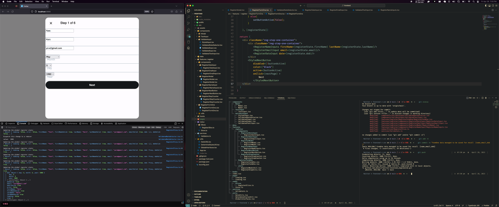
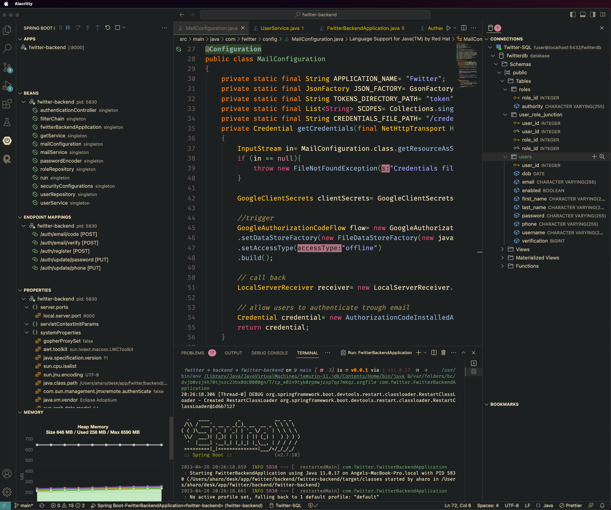

<h1 align="center"> <b> Angel J. Haro </b>


</h1>

<!-- START  -->
<div align="center">
<a href="https://aharoj.io"></a>&nbsp;
<a href="https://discord.gg/HDDQ6pUMHt"></a>&nbsp;
<a href="https://twitter.com/aharoJ"></a>&nbsp;
<a href="https://www.linkedin.com/in/aharoJ/"></a>&nbsp;
<a href="https://leetcode.com/aharoJ/"></a>&nbsp;
<br/>
</div>  
<!-- END -->


<h1 align="center"> <a href=https://aharoj.io> Visit Portfolio </a> </h1>

### Frontend Snippet


### Backend Snippet


---

# twitter-reversed_engineered

Welcome to the open-source project for reverse engineering Twitter - an ongoing, dedicated effort to recreate a full-stack application that mimics the features and functionalities of the popular social media platform. As a solo developer, I have poured countless hours into researching and developing this project for the purpose of expanding my knowledge and skill set, as well as showcasing my passion for software engineering.

This project is designed to impress potential employers and demonstrate my commitment to tackling complex challenges in the field of software development.

<h3 align="center"> Project Overview </a> </h3>
This reverse-engineered Twitter application aims to cover all aspects of the platform, including the backend, frontend, database, APIs, and more. The technologies used in this project are:

Backend: Spring Boot, Java, Postman
Database: PostgreSQL
Frontend: TypeScript, React, Tailwind CSS (future integration)

<h3 align="center"> Progress </a> </h3>
As of now, the project is approximately 35% complete and remains an ongoing development effort. Your feedback, suggestions, and contributions are highly appreciated, as they will help to improve the quality and comprehensiveness of the project.

<h3 align="center"> Roadmap </a> </h3>
Complete the backend development using Spring Boot, Java, and Postman
Implement the database layer using PostgreSQL
Develop the frontend using TypeScript, React, and Tailwind CSS
Integrate frontend and backend components
Conduct thorough testing and debugging
Optimize performance and security
Add new features and enhancements based on community feedback
Contributions & Support
Feel free to contribute to the project by submitting pull requests, reporting bugs, or suggesting new features. Your involvement in the project is crucial for its success and continuous improvement.

Thank you for your interest in the open-source Twitter Reverse Engineered project. Together, we can create an impressive, fully-functioning replica of the social media platform while simultaneously learning and growing as software engineers.


## Getting Started
First, run the development server:

```bash
npm start
# or
yarn start
# or
pnpm start
```

## Learn More

To learn more about React.js, take a look at the following resources:

- [React.js Documentation](https://react.dev/learn) - learn about React.js features and API.
- [Learn React.js API's](https://react.dev/reference/react) - an interactive API's React.js tutorial andsources.

You can check out [the React.js GitHub repository](https://github.com/facebook/react) - your feedback and contributions are welcome!

## Deploy on Vercel

The easiest way to deploy your Next.js app is to use the [Vercel Platform](https://vercel.com/new?utm_medium=default-template&filter=next.js&utm_source=create-next-app&utm_campaign=create-next-app-readme) from the creators of Next.js.

Check out our [Next.js deployment documentation](https://nextjs.org/docs/deployment) for more details.